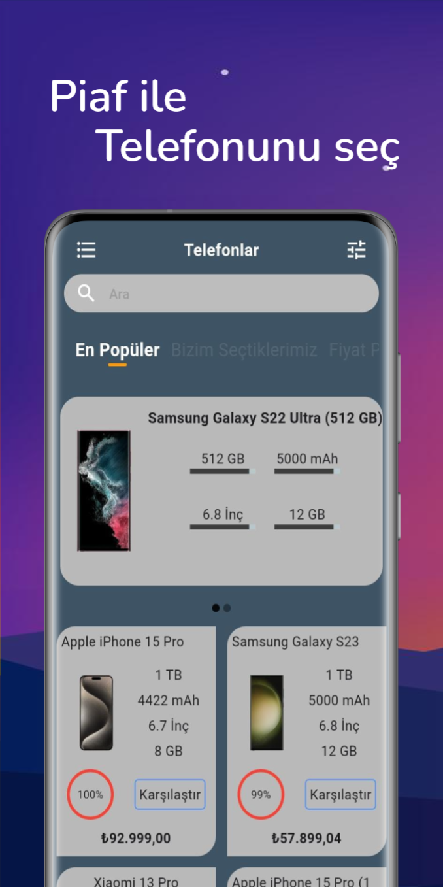
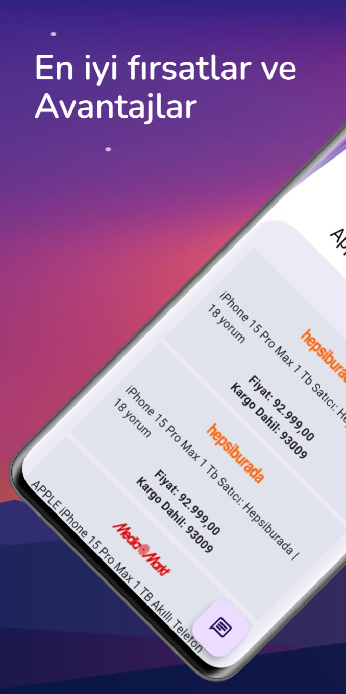
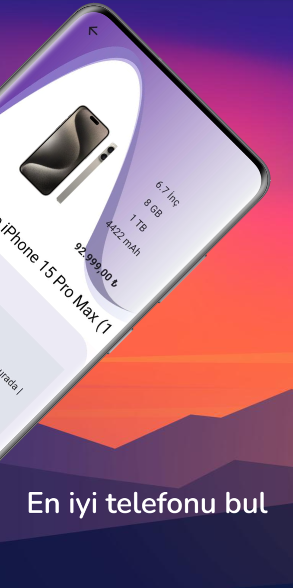
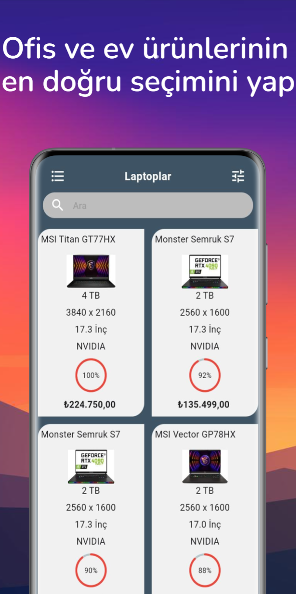
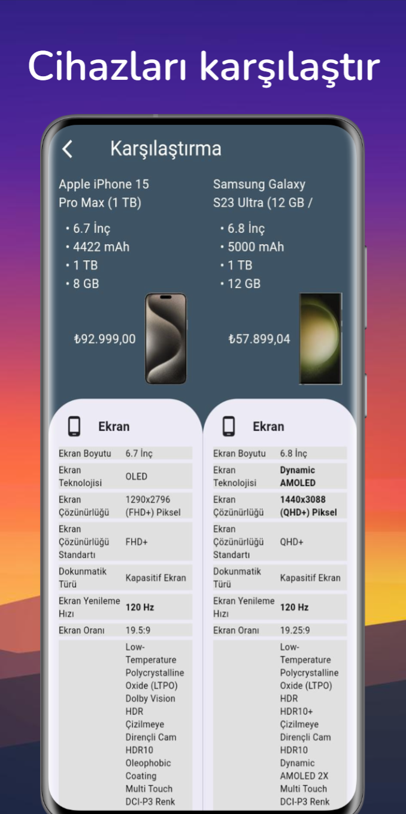

# CompareApp - Smart Phone Comparison Tool 📱⚖️

**CompareApp** is the ultimate phone comparison tool designed to help you make informed decisions when choosing your next smartphone. Instantly compare devices side by side and explore detailed specs, pros & cons, and user-friendly breakdowns.

📲 [Download on Google Play](https://play.google.com/store/apps/details?id=com.bonjour.compare_app)

## Features

- 📊 Side-by-side smartphone comparisons  
- 🔍 Detailed tech specs & feature breakdowns  
- ✅ Pros & Cons analysis for each device  
- 🌐 Offline mode supported  
- 🧠 Simple, fast and intuitive interface

## Ideal For

- 📱 Tech enthusiasts
- 💡 Shoppers looking to buy a new phone
- 📊 Content creators reviewing devices

## Screenshots

> All screenshots are taken directly from the Play Store version.
